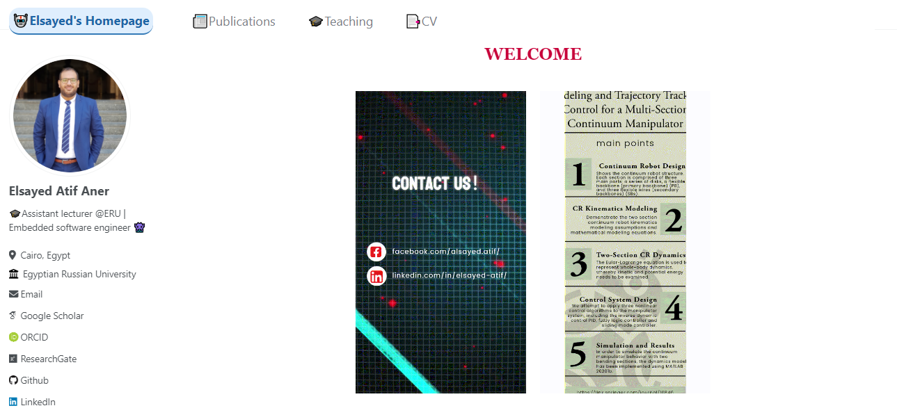

<div style="text-align: center;">
  
</div>
<br>

<div style="text-align: center;">
<h1> 🏄‍♂️ Welcome to the GitHub Repository for My Personal Website! </h1>
</div>

### 📝 Introduction
<p style="text-align: justify;">
  This repository contains the source code and content for my personal website, available at
  <a href="https://github.com/ElsayedAner/elsayedaner.github.io">elsayedaner.github.io</a>.
  Here, you'll find all the resources needed to understand the structure of the website and how it's maintained.
</p>

#

### 🗃️ Repository Structure

Below is a description of the main components found in this repository:

- **`_config.yml`**: Configuration file for setting options and managing the look and feel of the website.
- **`_data`**: Contains YAML files for managing data like authors, comments, navigation, and UI texts. Useful for configuring site-wide data.
- **`_drafts`**: Drafts of posts or pages that are not yet published.
- **`_includes`**: HTML fragments and other code snippets that can be included in other files. Includes headers, footers, sidebar components, and more.
- **`_layouts`**: Templates for different types of pages on the website (like posts, default page layout, and others).
- **`_pages`**: Contains Markdown and HTML files for the non-post pages of your site, such as "About Me", "CV", and other standalone pages.
- **`_posts`**: Blog posts or news items written in Markdown. These files are typically organized by date.
- **`_sass`**: Sass/SCSS files that define the style of the website. They are processed into CSS that styles the site.
- **`assets`**: Contains static files like CSS, JavaScript, and images. Used to style content and add interactivity.
- **`files`**: Directory for uploading files, such as PDFs or documents, that might be linked from the website.
- **`images`**: Contains image files used throughout the website. Includes screenshots, photos, and icons.

Each directory is crucial for different aspects of the website, helping organize content, style, functionality, and more.

## 🔧 How to Use This Repository

This repository hosts the source code for my personal website built with GitHub Pages and the Minimal theme. Here’s how you can use and contribute to this repository:

### 👀 Viewing the Website

To view the website, simply go to [elsayedaner.github.io](https://elsayedaner.github.io/). This link will take you to the live version of the website, which is automatically generated from the content in this repository.

### 💻 Running Locally

If you'd like to run the website locally on your machine:

1. Clone the repository:
   ```bash
   git clone https://github.com/ElsayedAner/elsayedaner.github.io.git
   cd elsayedaner.github.io
   ```

2. Since this is a GitHub Pages site using the Minimal theme, you can simply open the `index.html` file in your browser to see the site. Alternatively, if you want to serve the site on a local server, you can use Jekyll:
   ```bash
   bundle exec jekyll serve
   ```
   This command will build the site and serve it locally. You can then access it at `http://localhost:4000`.

#

### ✍ Contributing

I welcome contributions to this repository, whether they are improvements to the website's content, bug fixes, or new features:

1. Fork the repository.
2. Create a new branch for your changes:
   ```bash
   git checkout -b name-of-your-branch
   ```
3. Make your changes and commit them:
   ```bash
   git commit -am 'Add some feature or fix'
   ```
4. Push the branch to GitHub:
   ```bash
   git push origin name-of-your-branch
   ```
5. Submit a pull request through the GitHub website.

Please make sure to update tests as appropriate and adhere to the existing code style.

Thank you for visiting and I hope you find the resources helpful!

#

### 🎞️ Galary

<div align="center">
  
  
</div>
<br>
<div align="center">
  
</div>
<br>

#

### 📊 Stats

<p align="center">
  
</p>