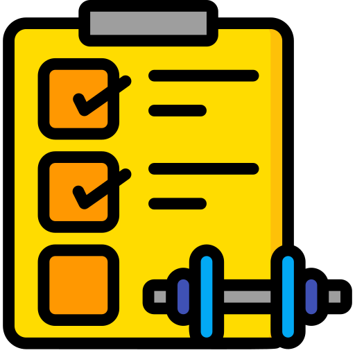

    <h1 class="exercises-header" style="background: #ffffff00; --header-text-color: #474646; padding: 0px;"> Welcome to the Mechanical Design Course with AutoCAD</h1>
    

Embark on a journey to master the art of mechanical design using AutoCAD, one of the most powerful and versatile drafting software tools in the engineering and architectural fields. This course is designed for students, professionals, and enthusiasts who aspire to enhance their technical skills, create precise 2D and 3D models, and streamline the design process from concept to fabrication.

## Course Overview

Through a series of structured modules, you will learn the fundamentals of mechanical design, including the principles of mechanics, material selection, and component design. We will delve deep into AutoCAD, starting from basic commands to advanced techniques for creating complex assemblies and simulations. Each session is crafted to build your proficiency, ensuring you can apply your learning to real-world scenarios.

## What You Will Learn

- **Fundamentals of Mechanical Design:** Understand the core concepts of mechanics, materials science, and how they apply to design.
- **AutoCAD Essentials:** Navigate the AutoCAD interface and master the basic tools for drafting, editing, and viewing drawings.
- **Advanced Modeling Techniques:** Learn to create detailed 3D models and assemblies that meet engineering standards.

<h2 class="exercises-header" style="--header-start-color: {{ page.card_color }}; --header-text-color: {{ page.text_color }};"> Exercises</h2>

## 🔸 Example #1:
<ul class="pdf-list">
  <li><a class="pdf-link" href="../files/mechanical_drawing/ex_1/ex_1.dwg" target="_blank"> CAD file</a></li>
</ul>

   
  

## 🔸 Example #2:

    

        <ul class="pdf-list">
            <li><a class="pdf-link" href="../files/mechanical_drawing/ex_2/ex_1.dwg" target="_blank"> CAD file</a></li>
            <li><a class="pdf-link" href="../files/mechanical_drawing/ex_2/Assem1.SLDASM" target="_blank"> Assembly</a></li>
            <li><a class="pdf-link" href="../files/mechanical_drawing/ex_2/Part1.SLDPRT" target="_blank"> Part #1</a></li>
            <li><a class="pdf-link" href="../files/mechanical_drawing/ex_2/Part2.SLDPRT" target="_blank"> Part #2</a></li>
            <li><a class="pdf-link" href="../files/mechanical_drawing/ex_2/Part3.SLDPRT" target="_blank"> Part #3</a></li>
            <li><a class="pdf-link" href="../files/mechanical_drawing/ex_2/Part4.SLDPRT" target="_blank"> Part #4</a></li>
            <li><a class="pdf-link" href="../files/mechanical_drawing/ex_2/Part5.SLDPRT" target="_blank"> Part #5</a></li>
            <li><a class="pdf-link" href="../files/mechanical_drawing/ex_2/Part6.SLDPRT" target="_blank"> Part #6</a></li>
            <li><a class="pdf-link" href="../files/mechanical_drawing/ex_2/Part7.SLDPRT" target="_blank"> Part #7</a></li>
        </ul>
    

    

        
    

  

## 🔸 Example #3:
<ul class="pdf-list">
    <li><a class="pdf-link" href="../files/mechanical_drawing/ex_3/ex_1.dwg" target="_blank"> CAD file</a></li>
</ul>

  

## 🔸 Example #4:
<ul class="pdf-list">
    <li><a class="pdf-link" href="../files/mechanical_drawing/ex_4/ex_4.dwg" target="_blank"> CAD file</a></li>
</ul>

  

 

<h2 class="exercises-header" style="--header-start-color: {{ page.card_color }}; --header-text-color: {{ page.text_color }};"> Videos</h2>

## Available Soon!
 

<h2 class="exercises-header" style="--header-start-color: {{ page.card_color }}; --header-text-color: {{ page.text_color }};"> Sample Exams</h2>

## Available Soon!
