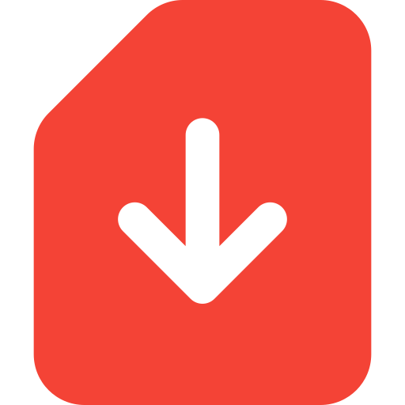
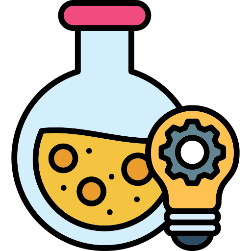

<!-- ############################## ++++++++++++++ Body Start ++++++++++++++ ############################## -->

    <h1 class="exercises-header" style="background: #ffffff00; --header-text-color: #474646; padding: 0px;"> Welcome to the XXX Course</h1>
    

<h2 class="exercises-header" style="background: #ffffff00; --header-text-color: #474646; padding: 0px; text-decoration: none;"> What You Will Learn</h2>

<h2 class="exercises-header" style="background: #ffffff00; --header-text-color: #474646; padding: 0px; text-decoration: none;"> Course Features</h2>

<h2 class="exercises-header" style="--header-start-color: {{ page.card_color }}; --header-text-color: {{ page.text_color }};"> Downloadable Resources</h2>

<h2 class="exercises-header" style="--header-start-color: {{ page.card_color }}; --header-text-color: {{ page.text_color }};"> Videos</h2>

<h2 class="exercises-header" style="--header-start-color: {{ page.card_color }}; --header-text-color: {{ page.text_color }};"> Experiments</h2>

<h2 class="exercises-header" style="--header-start-color: {{ page.card_color }}; --header-text-color: {{ page.text_color }};"> Sample Exams</h2>

<!-- ############################## ++++++++++++++ Body End ++++++++++++++ ############################## -->
