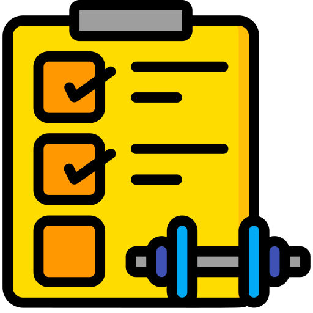
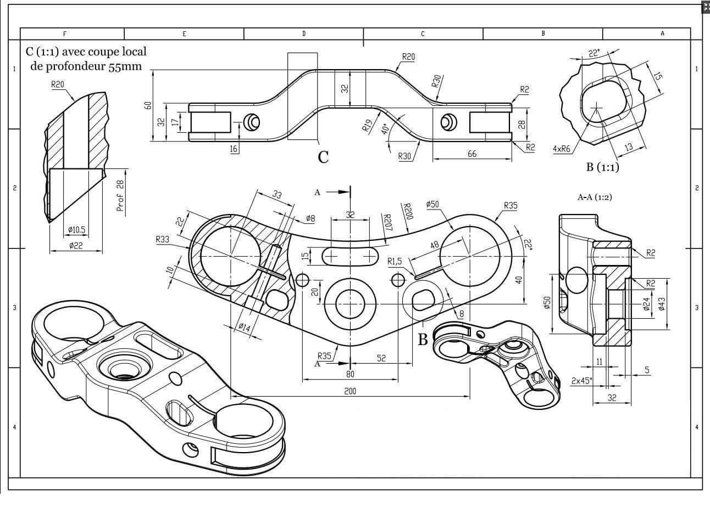
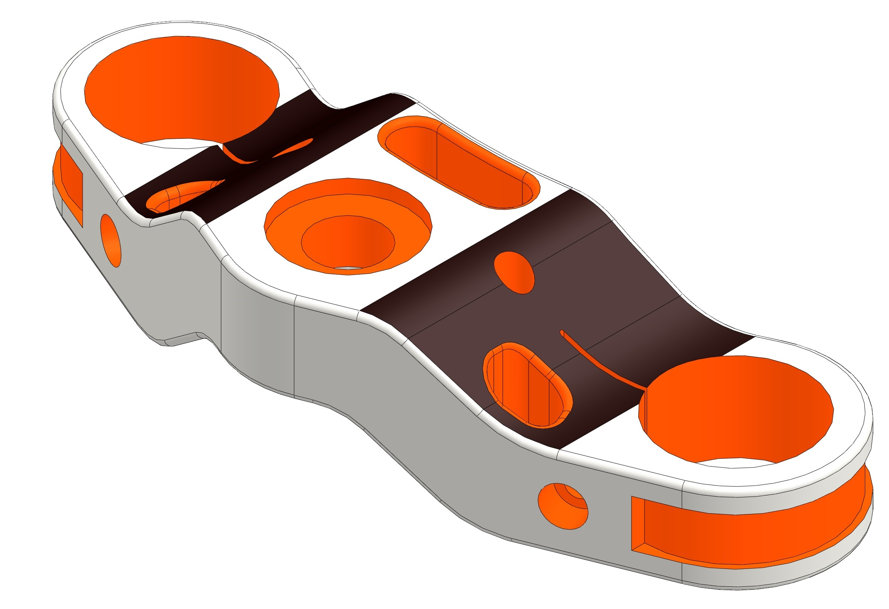
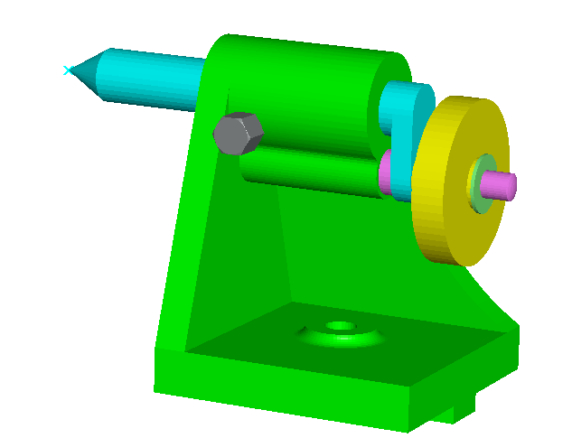
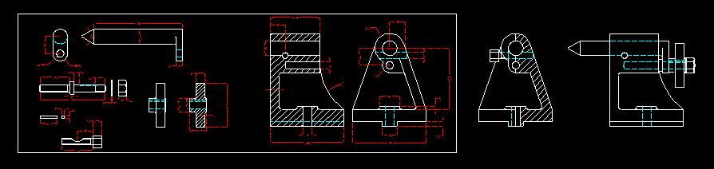
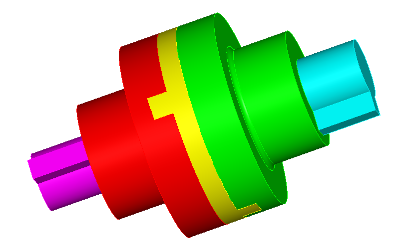
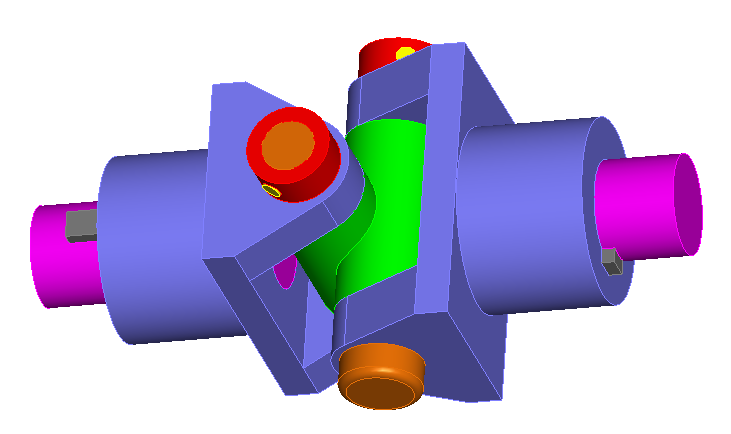
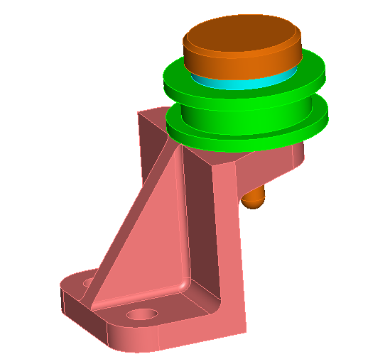
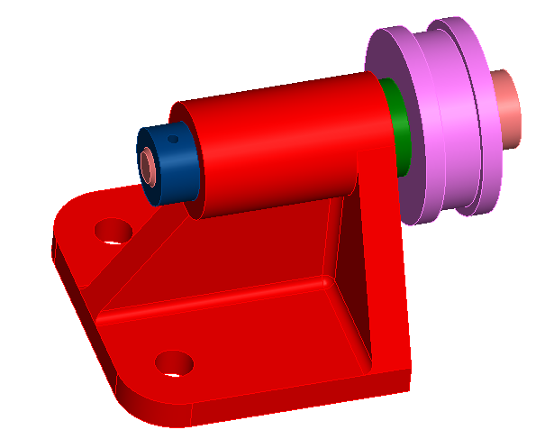

    <h1 class="exercises-header" style="background: #ffffff00; --header-text-color: #474646; padding: 0px;"> Welcome to the Mechanical Design Course with SolidWorks</h1>
    

Dive into the world of mechanical design using SolidWorks, a leading CAD and CAE software renowned for its powerful 3D modeling capabilities. This course is tailored for students, professionals, and hobbyists keen on enhancing their engineering design skills and bringing their innovative ideas to life through sophisticated 3D models and simulations.

## Course Overview

In this comprehensive course, you'll gain a thorough understanding of mechanical design principles and their application in SolidWorks. From navigating the user interface to mastering advanced features for simulation and analysis, the course covers a spectrum of skills needed to excel in the field of mechanical engineering and design.

## What You Will Learn

- **Mechanical Design Foundations:** Grasp the essential concepts of mechanics and materials science as they apply to real-world design.
- **SolidWorks Essentials:** Learn to efficiently navigate the SolidWorks interface and utilize its core tools for creating precise and detailed 3D models.
- **Advanced 3D Modeling Techniques:** Develop skills in constructing complex parts and assemblies that adhere to strict engineering standards.
- **Simulation and Stress Analysis:** Use SolidWorks Simulation to evaluate the durability and performance of components under various conditions.

<h2 class="exercises-header" style="--header-start-color: {{ page.card_color }}; --header-text-color: {{ page.text_color }};"> Exercises</h2>

## 🔸 Example #1:
<ul class="pdf-list">
    <li><a class="pdf-link" href="../files/mechanical_drawing/ex_1/example_1.SLDPRT" target="_blank"> SolidWorks</a></li>
</ul>

    
    

## 🔸 Example #2:

    

        <ul class="pdf-list">
            <li><a class="pdf-link" href="../files/mechanical_drawing/ex_2/ex_1.dwg" target="_blank"> CAD file</a></li>
            <li><a class="pdf-link" href="../files/mechanical_drawing/ex_2/Assem1.SLDASM" target="_blank"> Assembly</a></li>
            <li><a class="pdf-link" href="../files/mechanical_drawing/ex_2/Part1.SLDPRT" target="_blank"> Part #1</a></li>
            <li><a class="pdf-link" href="../files/mechanical_drawing/ex_2/Part2.SLDPRT" target="_blank"> Part #2</a></li>
            <li><a class="pdf-link" href="../files/mechanical_drawing/ex_2/Part3.SLDPRT" target="_blank"> Part #3</a></li>
            <li><a class="pdf-link" href="../files/mechanical_drawing/ex_2/Part4.SLDPRT" target="_blank"> Part #4</a></li>
            <li><a class="pdf-link" href="../files/mechanical_drawing/ex_2/Part5.SLDPRT" target="_blank"> Part #5</a></li>
            <li><a class="pdf-link" href="../files/mechanical_drawing/ex_2/Part6.SLDPRT" target="_blank"> Part #6</a></li>
            <li><a class="pdf-link" href="../files/mechanical_drawing/ex_2/Part7.SLDPRT" target="_blank"> Part #7</a></li>
        </ul>

    

    

        
    

  

## 🔸 Example #3:

    

        <ul class="pdf-list">
            <li><a class="pdf-link" href="../files/solidworks/ex_3/Assem1.SLDASM" target="_blank"> Assembly</a></li>
            <li><a class="pdf-link" href="../files/solidworks/ex_3/Part1.SLDPRT" target="_blank"> Part #1</a></li>
            <li><a class="pdf-link" href="../files/solidworks/ex_3/Part2.SLDPRT" target="_blank"> Part #2</a></li>
            <li><a class="pdf-link" href="../files/solidworks/ex_3/Part3.SLDPRT" target="_blank"> Part #3</a></li>
            <li><a class="pdf-link" href="../files/solidworks/ex_3/Part4.SLDPRT" target="_blank"> Part #4</a></li>
            <li><a class="pdf-link" href="../files/solidworks/ex_3/Part5.SLDPRT" target="_blank"> Part #5</a></li>
        </ul>
    

    

        
    

## 🔸 Example #4:

    

        <ul class="pdf-list">
            <li><a class="pdf-link" href="../files/solidworks/ex_4/Assem1.SLDASM" target="_blank"> Assembly</a></li>
            <li><a class="pdf-link" href="../files/solidworks/ex_4/Part1.SLDPRT" target="_blank"> Part #1</a></li>
            <li><a class="pdf-link" href="../files/solidworks/ex_4/Part2.SLDPRT" target="_blank"> Part #2</a></li>
            <li><a class="pdf-link" href="../files/solidworks/ex_4/Part3.SLDPRT" target="_blank"> Part #3</a></li>
            <li><a class="pdf-link" href="../files/solidworks/ex_4/Part4.SLDPRT" target="_blank"> Part #4</a></li>
            <li><a class="pdf-link" href="../files/solidworks/ex_4/Part5.SLDPRT" target="_blank"> Part #5</a></li>
            <li><a class="pdf-link" href="../files/solidworks/ex_4/Part6.SLDPRT" target="_blank"> Part #6</a></li>
            <li><a class="pdf-link" href="../files/solidworks/ex_4/Part7.SLDPRT" target="_blank"> Part #7</a></li>
        </ul>
    

    

        
    

## 🔸 Example #5:

    

        <ul class="pdf-list">
            <li><a class="pdf-link" href="../files/solidworks/ex_5/Assem1.SLDASM" target="_blank"> Assembly</a></li>
            <li><a class="pdf-link" href="../files/solidworks/ex_5/Part1.SLDPRT" target="_blank"> Part #1</a></li>
            <li><a class="pdf-link" href="../files/solidworks/ex_5/Part2.SLDPRT" target="_blank"> Part #2</a></li>
            <li><a class="pdf-link" href="../files/solidworks/ex_5/Part3.SLDPRT" target="_blank"> Part #3</a></li>
            <li><a class="pdf-link" href="../files/solidworks/ex_5/Part4.SLDPRT" target="_blank"> Part #4</a></li>
        </ul>
    

    

        
    

## 🔸 Example #6:

    

        <ul class="pdf-list">
            <li><a class="pdf-link" href="../files/solidworks/ex_6/Assem1.SLDASM" target="_blank"> Assembly</a></li>
            <li><a class="pdf-link" href="../files/solidworks/ex_6/Part1.SLDPRT" target="_blank"> Part #1</a></li>
            <li><a class="pdf-link" href="../files/solidworks/ex_6/Part2.SLDPRT" target="_blank"> Part #2</a></li>
            <li><a class="pdf-link" href="../files/solidworks/ex_6/Part3.SLDPRT" target="_blank"> Part #3</a></li>
            <li><a class="pdf-link" href="../files/solidworks/ex_6/Part4.SLDPRT" target="_blank"> Part #4</a></li>
            <li><a class="pdf-link" href="../files/solidworks/ex_6/Part5.SLDPRT" target="_blank"> Part #5</a></li>
        </ul>
    

    

        
    

 

<h2 class="exercises-header" style="--header-start-color: {{ page.card_color }}; --header-text-color: {{ page.text_color }};"> Videos</h2>

    

        

            

                <iframe src="https://www.youtube.com/embed/3yrYWrJlJRo" title="How to Install/Uninstall SolidWorks"
                    allow="accelerometer; autoplay; clipboard-write; encrypted-media; gyroscope; picture-in-picture"
                    allowfullscreen></iframe>
            

            
How to Install/Uninstall SolidWorks 
            <a href="https://www.linkedin.com/in/mohamed-khaled-farouk/" target="_blank">👨‍🏫 Eng. Mohamed Farouk</a>

        

        

            

                <iframe src="https://www.youtube.com/embed/5Dn_4QO50SI" title="How to Install/Uninstall SolidWorks"
                    allow="accelerometer; autoplay; clipboard-write; encrypted-media; gyroscope; picture-in-picture"
                    allowfullscreen></iframe>
            

            
Getting Started with SolidWorks 
            <a href="https://www.linkedin.com/in/mohamed-khaled-farouk/" target="_blank">👨‍🏫 Eng. Mohamed Farouk</a>

        

    
 

 

<h2 class="exercises-header" style="--header-start-color: {{ page.card_color }}; --header-text-color: {{ page.text_color }};"> Sample Exams</h2>

## Available Soon!
