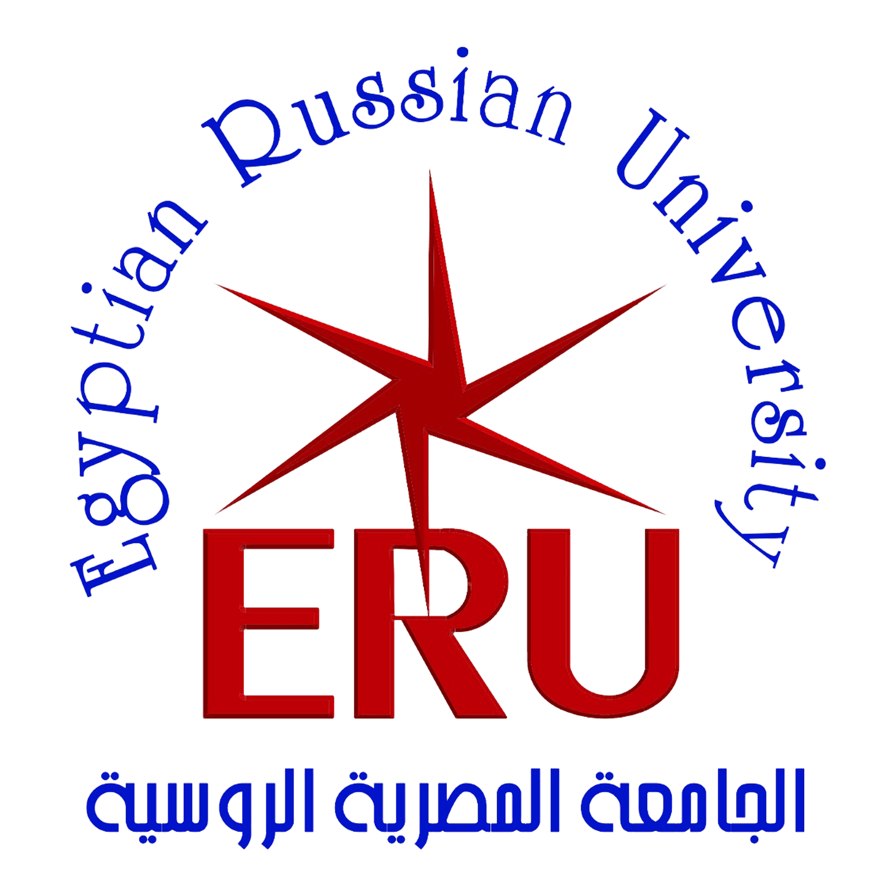

 

    

        <!-- Your paragraph goes here -->
        As a dedicated Assistant lecturer at the Faculty of Engineering, <a href="http://www.eru.edu.eg/" target="_blank">Egyptian Russian University (ERU)</a>, I had the privilege of contributing to the academic growth and development of students. My role encompassed a diverse range of responsibilities, including assisting professors during lectures, conducting tutorials, and providing one-on-one guidance to students. I facilitated engaging discussions, clarified complex concepts, and encouraged critical thinking. My commitment extended beyond the classroom—I actively participated in curriculum development, designed practical experiments, and mentored students in research projects. Through my interactions with aspiring engineers, I fostered a passion for learning, instilled confidence, and helped shape the next generation of professionals. It was a rewarding journey marked by collaboration, knowledge sharing, and a genuine desire to ignite curiosity within our students.
    

    

      
    

 

Courses
======

* Fluid Mechanics
* Thermodynamics
* Embedded system
* Engineering Materials
* Hydraulic & Pneumatic
* Mechanical Systems Laboratory
* Mechanical Drawing (AutoCAD)
* Computer Aided Design (SolidWorks)

