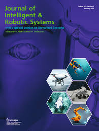

<!-- Publications ----------------------------------->

  <!-- Abstract Section -->
  

    <h3 style="color: #00734D">Abstract:</h3>
    

      This paper presents a dynamic modeling and trajectory tracking control design for a hyper-redundant continuum manipulator (HRM), which is able to continuously bend along its length. The HRM has the advantages of high flexibility, large workspace, and low inertia, but also poses challenges of complex kinematics, and dynamic coupling. To address these challenges, the kinematics model was developed based on the piecewise constant curvature (PCC) assumption that captures the relationship between the cable lengths, joint angles, and end-effector pose. Inverse kinematics is presented geometrically by solving trigonometric equations. The dynamic model for the continuum robot (CR) is derived using the Euler–Lagrange representation, which incorporates the effects of gravity and elasticity. Accordingly, three control strategies are developed and applied to a two-section continuum robot, which are the inverse dynamic proportional integral derivative controller (PID), fuzzy logic controller (FLC), and sliding mode controller (SMC). We validate our proposed methods through simulations on various 3D trajectories, utilized MATLAB symbolic math toolbox in conjunction with Simulink simulation; demonstrate and evaluate different close-loop dynamic control responses for different scenarios. This simulation used in the creation of a unique animated simulation for a whole 3D continuum robot while tracking its desired trajectories. Finally, the simulation results demonstrate that our proposed methods can effectively control the HRM with high tracking performance, exhibiting enhanced responses in terms of settling time, rising time, and steady-state error. While the developed SMC outperforms Poth's PID and FLC in terms of robustness and settling time (51% and 10.3%), respectively.
    

    <h3 style="display: inline; font-family: 'Times New Roman', Times, serif; font-size: 16px; margin-right: 10px; text-align: justify; color: #00734D">Keywords:</h3>
    
      Continuum robotic arm, Dynamics, Hyper-redundant manipulator, Position control, Sliding mode controller, Trajectory control
    
  

  <!-- Image Section -->
  

    
  

 

  

    
    
Modeling and Trajectory Tracking Control for a Multi-Section Continuum Manipulator

    
Journal of Intelligent & Robotic Systems

  

 

<!-- Embed PDF -->

    <object data="../files/s10846-023-01896-1.pdf?inline=true" type="application/pdf" width="100%" height="80px">
        <embed src="../files/s10846-023-01896-1.pdf?inline=true" type="application/pdf" width="100%" height="80px">
            <!-- Fallback content for browsers that don't support embedding PDFs -->
            
Your browser does not support PDFs. <a href="../files/s10846-023-01896-1.pdf?inline=true">Download the PDF</a>.

        </embed>
    </object>

