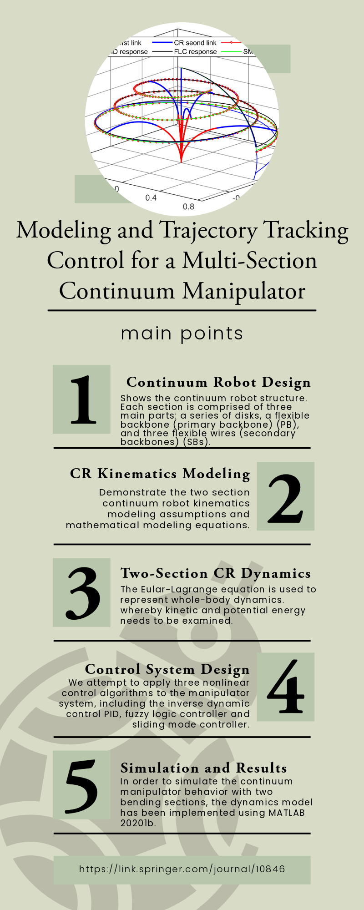

<!-- Publications ----------------------------------->
<!-- New Row for Additional Publications/Images -->

  

    
  

 

  

    
    
Modeling and Trajectory Tracking Control for a Multi-Section Continuum Manipulator

    
Journal of Intelligent & Robotic Systems

  

 

<!-- Embed PDF -->

    <object data="../files/s10846-023-01896-1.pdf?inline=true" type="application/pdf" width="100%" height="80px">
        <embed src="../files/s10846-023-01896-1.pdf?inline=true" type="application/pdf" width="100%" height="80px">
            <!-- Fallback content for browsers that don't support embedding PDFs -->
            
Your browser does not support PDFs. <a href="../files/s10846-023-01896-1.pdf?inline=true">Download the PDF</a>.

        </embed>
    </object>

