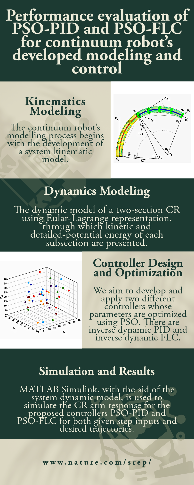

<head>
  <link rel="stylesheet" href="../_pages/css/videos.css">
</head>

<!-- Publications ----------------------------------->

  <!-- Abstract Section -->
  

    <h3 style="color: #00734D">Abstract:</h3>
    

      Continuum robots are complex structures that require sophisticated modeling and control methods to achieve accurate position and motion tracking along desired trajectories. They are highly coupled, nonlinear systems with multiple degrees of freedom that pose a signifcant challenge for conventional approaches. In this paper, we propose a system dynamic model based on the Euler–Lagrange formulation with the assumption of piecewise constant curvature (PCC), where we accounts for the elasticity and gravity efects of the continuum robot. We also develop and apply a particle swarm optimization (PSO) algorithm to optimize the parameters of our developed controllers: an inverse dynamic proportional integral derivative (PID) controller and an inverse dynamic fuzzy logic controller (FLC), where we use the integral time of absolute error (ITAE) as the objective function for the PSO algorithm. We validate our proposed model and optimized controllers through diferent designed trajectories, simulated using our developed unique animated MATLAB simulation. The results show that the PSO-PID controller improves the rise time, overshoot percentage, and settling time by 16.3%, 31.1%, and 64.9%, respectively, compared to the PID controller without PSO. The PSO-FLC controller shows the best performance among all controllers, with a settling time of 0.7 s and a rise time of 0.4 s, leading to the highest level of precision in trajectory tracking. The ITAE error for the PSOFLC controller is 11.4% and 29.9% lower than that of the PSO-PID and FLC controllers, respectively.
    

  

  <!-- Image Section -->
  

    
  

 

<!-- ========================== Video ========================== -->

  

  <h2 style="color: #00734D">Videos:</h2>
  

    

        

            <iframe src="https://www.youtube.com/embed/tvBerdMUqiE" title="Performance evaluation of PSO PID and
              PSO FLC for continuum robot’s developed modeling and control" frameborder="0"
                allow="accelerometer; autoplay; clipboard-write; encrypted-media; gyroscope; picture-in-picture"
                allowfullscreen></iframe>
        

        

          Performance evaluation of PSO-PID and PSO-FLC for continuum robot’s developed modeling and control

    

  

  

    
    
Performance evaluation of PSO-PID and PSO-FLC for continuum robot’s developed modeling and control

    
Scientific Reports

  

 

<!-- ========================== Embed PDF ========================== -->

    <object data="../files/s41598-023-50551-0.pdf?inline=true" type="application/pdf" width="100%" height="80px">
        <embed src="../files/s41598-023-50551-0.pdf?inline=true" type="application/pdf" width="100%" height="80px">
            <!-- Fallback content for browsers that don't support embedding PDFs -->
            
Your browser does not support PDFs. <a href="../files/s41598-023-50551-0.pdf?inline=true">Download the PDF</a>.

        </embed>
    </object>

