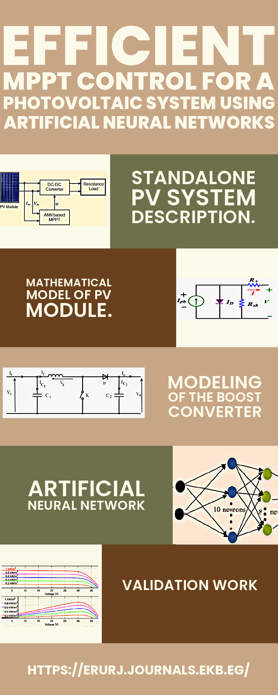

<!-- Publications ----------------------------------->

  <!-- Abstract Section -->
  

    <h3 style="color: #00734D">Abstract:</h3>
    

      The photovoltaic (PV) system with maximum power point tracking (MPPT) is a frequently employed method for achieving an effective strategy under variable climatic conditions such as varying irradiance and temperature levels. This research investigates increasing the efficiency of a PV system via an artificial neural network (ANN). A feedforward neural network receives measured current and voltage as inputs and estimates the optimum duty cycle corresponding to maximum power as output. The ANN automatically detects the MPP of the PV module by using a preselected number of power measurements of the PV system. The PV system typically displays an I-V nonlinear feature curve with varying MPPs based on solar irradiance and temperature. The maximum power the PV module produces can be transferred to the load when the PV system operates at its MPP. This is achieved by matching the impedance between the PV system and the load through the DC-DC converter with an ANN that adjusts the converter’s duty cycle. The results demonstrate that the proposed ANN is more effective and that oscillations around the MPP are significantly decreased during uniform irradiance levels, sudden changes in irradiance levels, and sudden changes in temperature levels.
    

    <h3 style="display: inline; font-family: 'Times New Roman', Times, serif; font-size: 16px; margin-right: 10px; text-align: justify; color: #00734D">Keywords:</h3>
    
      	Photovoltaic system, MPPT control, DC-DC boost converter, Artificial Neural Networks.
    
  

  <!-- Image Section -->
  

    
  

 

  

    
    
Efficient MPPT control for a photovoltaic system using artificial neural networks

    
ERU Research Journal

  

 

<!-- Embed PDF -->

    <object data="../files/ERURJ_Volume 2_Issue 3_Pages 385-398.pdf?inline=true" type="application/pdf" width="100%" height="80px">
        <embed src="../files/ERURJ_Volume 2_Issue 3_Pages 385-398.pdf?inline=true" type="application/pdf" width="100%" height="80px">
            <!-- Fallback content for browsers that don't support embedding PDFs -->
            
Your browser does not support PDFs. <a href="../files/ERURJ_Volume 2_Issue 3_Pages 385-398.pdf?inline=true">Download the PDF</a>.

        </embed>
    </object>

